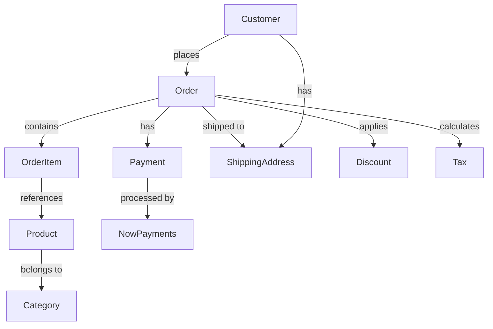
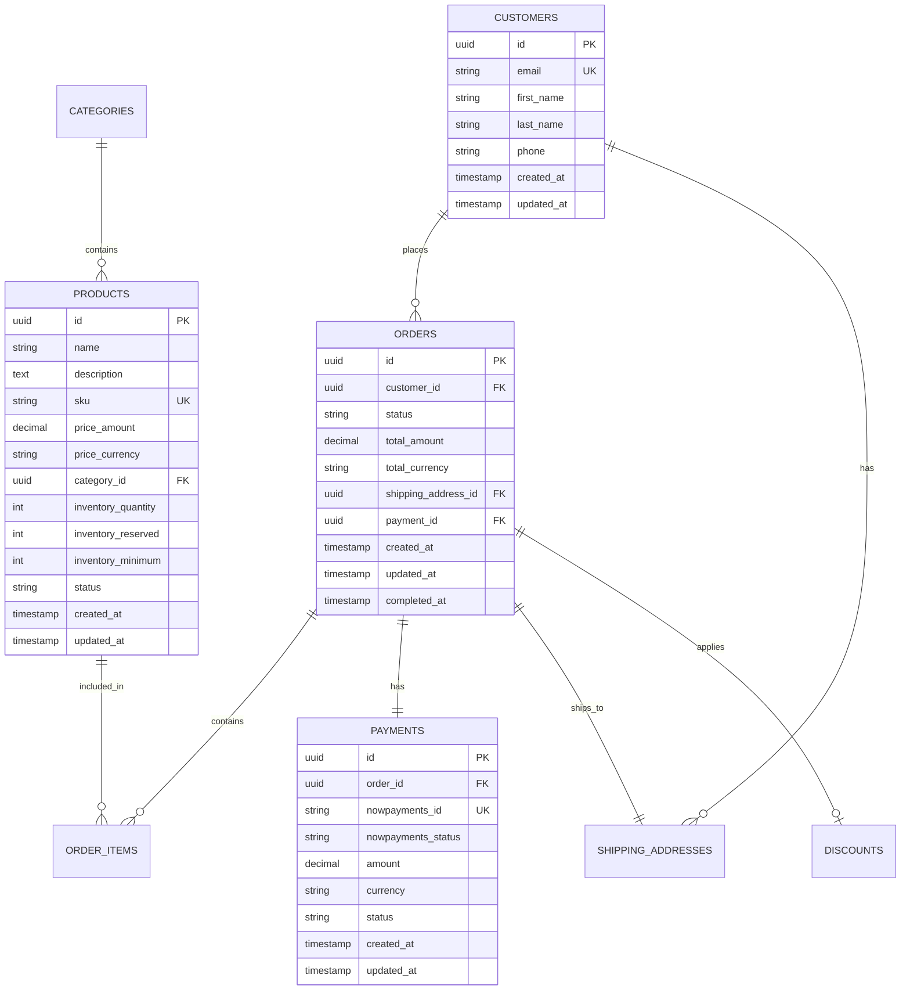
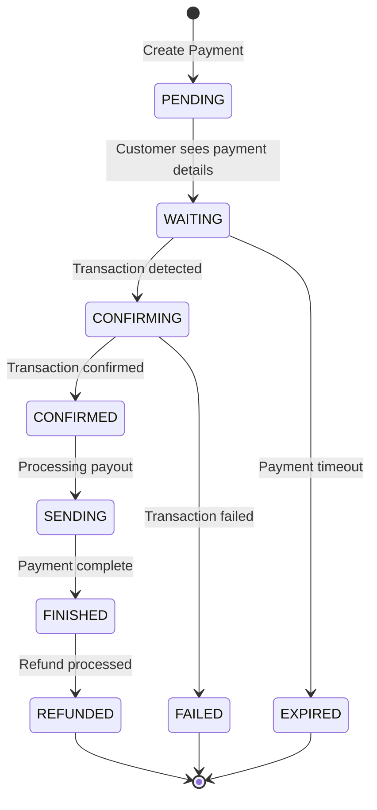

# PaymentSystem MVP - Comprehensive Documentation 📋

## Table of Contents

1. Project Overview
2. Business Domain Model
3. Use Cases & User Stories
4. System Architecture
5. Database Design
6. Domain-Driven Design
7. API Design
8. NowPayments Integration
9. Implementation Strategy
10. Testing Strategy

---

## 1. Project Overview

### 1.1 Business Description

**PaymentSystem** is an MVP e-commerce platform that enables a single merchant to sell physical products to customers using cryptocurrency payments exclusively through NowPayments integration.

### 1.2 Key Features

- **Product Management**: Inventory, pricing, categories
- **Order Processing**: Cart to fulfillment workflow
- **Crypto Payments**: NowPayments integration for crypto-only transactions
- **Multi-Currency**: Support for multiple cryptocurrencies
- **Shipping Management**: Address management and order tracking
- **Refund Processing**: Handle payment refunds and disputes
- **Tax Calculation**: Automated tax computation
- **Discount System**: Coupon and promotional codes

### 1.3 Target Users

- **Customers**: End users purchasing products with cryptocurrency
- **Merchant/Admin**: Single business owner managing products, orders, and operations

---

## 2. Business Domain Model

### 2.1 Core Domains

#### **Product Domain** 🛍️

- Product catalog management
- Inventory tracking
- Pricing and categories
- Product variants (size, color, etc.)

#### **Order Domain** 🛒

- Shopping cart functionality
- Order lifecycle management
- Order item management
- Order status tracking

#### **Payment Domain** 💰

- Cryptocurrency payment processing
- NowPayments integration
- Payment status tracking
- Refund management

#### **Customer Domain** 👤

- Customer registration and profiles
- Shipping address management
- Order history

#### **Shipping Domain** 📦

- Shipping address validation
- Shipping cost calculation
- Order fulfillment tracking

#### **Admin Domain** ⚙️

- Product management
- Order management
- Payment monitoring
- System configuration

### 2.2 Domain Relationships



---

## 3. Use Cases & User Stories

### 3.1 Customer Use Cases

#### **UC-01: Browse Products**

- **Actor**: Customer
- **Goal**: View available products with details
- **Precondition**: Products exist in catalog
- **Flow**:
  1. Customer visits product catalog
  2. System displays products with images, prices, inventory
  3. Customer can filter by category, price range
  4. Customer can view detailed product information

#### **UC-02: Add Products to Cart**

- **Actor**: Customer
- **Goal**: Select products for purchase
- **Flow**:
  1. Customer selects product and quantity
  2. System validates inventory availability
  3. System adds item to shopping cart
  4. System updates cart total

#### **UC-03: Checkout Process**

- **Actor**: Customer
- **Goal**: Complete purchase with cryptocurrency
- **Flow**:
  1. Customer reviews cart items
  2. Customer provides shipping address
  3. System calculates shipping cost and taxes
  4. Customer applies discount code (optional)
  5. System creates order and initiates payment
  6. Customer completes crypto payment via NowPayments
  7. System confirms order and sends confirmation

#### **UC-04: Track Order**

- **Actor**: Customer
- **Goal**: Monitor order status and shipping
- **Flow**:
  1. Customer provides order ID or email
  2. System displays order status and tracking information
  3. Customer receives updates on order progress

### 3.2 Merchant/Admin Use Cases

#### **UC-05: Manage Products**

- **Actor**: Admin
- **Goal**: Add, update, remove products
- **Flow**:
  1. Admin accesses product management dashboard
  2. Admin creates/edits product with details
  3. System validates product information
  4. System updates product catalog

#### **UC-06: Manage Orders**

- **Actor**: Admin
- **Goal**: Process and fulfill orders
- **Flow**:
  1. Admin views pending orders
  2. Admin updates order status
  3. Admin processes shipping
  4. System notifies customer of updates

#### **UC-07: Handle Payments**

- **Actor**: Admin
- **Goal**: Monitor and manage payments
- **Flow**:
  1. Admin views payment dashboard
  2. Admin monitors payment status
  3. Admin processes refunds if needed
  4. System updates payment records

---

## 4. System Architecture

### 4.1 Clean Architecture Overview

```
┌─────────────────────────────────────────────────────────┐
│                 Presentation Layer                       │
│  ┌─────────────┐  ┌─────────────┐  ┌─────────────┐     │
│  │   REST API  │  │  Admin UI   │  │ Webhooks    │     │
│  └─────────────┘  └─────────────┘  └─────────────┘     │
└─────────────────────────────────────────────────────────┘
┌─────────────────────────────────────────────────────────┐
│                 Application Layer                        │
│  ┌─────────────┐  ┌─────────────┐  ┌─────────────┐     │
│  │   Use Cases │  │  Services   │  │ Orchestration│    │
│  └─────────────┘  └─────────────┘  └─────────────┘     │
└─────────────────────────────────────────────────────────┘
┌─────────────────────────────────────────────────────────┐
│                   Domain Layer                          │
│  ┌─────────────┐  ┌─────────────┐  ┌─────────────┐     │
│  │  Entities   │  │Value Objects│  │Business Rules│    │
│  └─────────────┘  └─────────────┘  └─────────────┘     │
└─────────────────────────────────────────────────────────┘
┌─────────────────────────────────────────────────────────┐
│                Infrastructure Layer                      │
│  ┌─────────────┐  ┌─────────────┐  ┌─────────────┐     │
│  │ PostgreSQL  │  │ NowPayments │  │   HTTP/REST │     │
│  └─────────────┘  └─────────────┘  └─────────────┘     │
└─────────────────────────────────────────────────────────┘
```

### 4.2 Project Structure

```
paymentSystem/
├── cmd/
│   └── api/
│       └── main.go                 # Application entry point
├── internal/
│   ├── domain/                     # Domain Layer
│   │   ├── product/
│   │   │   ├── product.go
│   │   │   ├── product_status.go
│   │   │   ├── inventory.go
│   │   │   ├── category.go
│   │   │   └── errors.go
│   │   ├── order/
│   │   │   ├── order.go
│   │   │   ├── order_status.go
│   │   │   ├── order_item.go
│   │   │   ├── money.go
│   │   │   └── errors.go
│   │   ├── payment/
│   │   │   ├── payment.go
│   │   │   ├── payment_status.go
│   │   │   ├── crypto_currency.go
│   │   │   └── errors.go
│   │   ├── customer/
│   │   │   ├── customer.go
│   │   │   ├── shipping_address.go
│   │   │   └── errors.go
│   │   └── shared/
│   │       ├── value_objects.go
│   │       └── events.go
│   ├── application/                # Application Layer
│   │   ├── product/
│   │   │   ├── create_product.go
│   │   │   ├── update_product.go
│   │   │   └── product_service.go
│   │   ├── order/
│   │   │   ├── create_order.go
│   │   │   ├── process_checkout.go
│   │   │   └── order_service.go
│   │   ├── payment/
│   │   │   ├── process_payment.go
│   │   │   ├── handle_webhook.go
│   │   │   └── payment_service.go
│   │   └── customer/
│   │       ├── register_customer.go
│   │       └── customer_service.go
│   ├── infrastructure/             # Infrastructure Layer
│   │   ├── persistence/
│   │   │   ├── postgresql/
│   │   │   ├── repositories/
│   │   │   └── migrations/
│   │   ├── payment/
│   │   │   └── nowpayments/
│   │   ├── http/
│   │   │   ├── handlers/
│   │   │   ├── middleware/
│   │   │   └── routes.go
│   │   └── config/
│   └── presentation/               # Presentation Layer
│       ├── http/
│       │   ├── handlers/
│       │   ├── dto/
│       │   └── middleware/
│       └── webhooks/
├── pkg/                           # Shared packages
├── config/                        # Configuration files
├── docker/                        # Docker configuration
├── scripts/                       # Utility scripts
└── docs/                         # Documentation
```

---

## 5. Database Design

### 5.1 PostgreSQL Schema

#### **Products Table**

```sql
CREATE TABLE products (
    id UUID PRIMARY KEY DEFAULT gen_random_uuid(),
    name VARCHAR(255) NOT NULL,
    description TEXT,
    sku VARCHAR(100) UNIQUE NOT NULL,
    price_amount DECIMAL(19,8) NOT NULL CHECK (price_amount > 0),
    price_currency VARCHAR(10) NOT NULL,
    category_id UUID REFERENCES categories(id),
    inventory_quantity INTEGER NOT NULL DEFAULT 0 CHECK (inventory_quantity >= 0),
    inventory_reserved INTEGER NOT NULL DEFAULT 0 CHECK (inventory_reserved >= 0),
    inventory_minimum INTEGER NOT NULL DEFAULT 0,
    status VARCHAR(20) NOT NULL CHECK (status IN ('ACTIVE', 'INACTIVE', 'OUT_OF_STOCK', 'DISCONTINUED')),
    created_at TIMESTAMP WITH TIME ZONE DEFAULT NOW(),
    updated_at TIMESTAMP WITH TIME ZONE DEFAULT NOW(),
    CONSTRAINT inventory_check CHECK (inventory_reserved <= inventory_quantity)
);
```

#### **Categories Table**

```sql
CREATE TABLE categories (
    id UUID PRIMARY KEY DEFAULT gen_random_uuid(),
    name VARCHAR(255) NOT NULL UNIQUE,
    description TEXT,
    parent_id UUID REFERENCES categories(id),
    created_at TIMESTAMP WITH TIME ZONE DEFAULT NOW(),
    updated_at TIMESTAMP WITH TIME ZONE DEFAULT NOW()
);
```

#### **Customers Table**

```sql
CREATE TABLE customers (
    id UUID PRIMARY KEY DEFAULT gen_random_uuid(),
    email VARCHAR(255) UNIQUE NOT NULL,
    first_name VARCHAR(100) NOT NULL,
    last_name VARCHAR(100) NOT NULL,
    phone VARCHAR(20),
    created_at TIMESTAMP WITH TIME ZONE DEFAULT NOW(),
    updated_at TIMESTAMP WITH TIME ZONE DEFAULT NOW()
);
```

#### **Shipping Addresses Table**

```sql
CREATE TABLE shipping_addresses (
    id UUID PRIMARY KEY DEFAULT gen_random_uuid(),
    customer_id UUID REFERENCES customers(id) ON DELETE CASCADE,
    label VARCHAR(50), -- 'Home', 'Work', etc.
    first_name VARCHAR(100) NOT NULL,
    last_name VARCHAR(100) NOT NULL,
    company VARCHAR(255),
    address_line1 VARCHAR(255) NOT NULL,
    address_line2 VARCHAR(255),
    city VARCHAR(100) NOT NULL,
    state VARCHAR(100) NOT NULL,
    postal_code VARCHAR(20) NOT NULL,
    country VARCHAR(2) NOT NULL, -- ISO country code
    phone VARCHAR(20),
    is_default BOOLEAN DEFAULT FALSE,
    created_at TIMESTAMP WITH TIME ZONE DEFAULT NOW(),
    updated_at TIMESTAMP WITH TIME ZONE DEFAULT NOW()
);
```

#### **Orders Table**

```sql
CREATE TABLE orders (
    id UUID PRIMARY KEY DEFAULT gen_random_uuid(),
    customer_id UUID REFERENCES customers(id),
    status VARCHAR(20) NOT NULL CHECK (status IN ('CREATED', 'PAID', 'FULFILLED', 'CANCELLED')),

    -- Pricing
    subtotal_amount DECIMAL(19,8) NOT NULL,
    subtotal_currency VARCHAR(10) NOT NULL,
    tax_amount DECIMAL(19,8) NOT NULL DEFAULT 0,
    tax_currency VARCHAR(10) NOT NULL,
    shipping_amount DECIMAL(19,8) NOT NULL DEFAULT 0,
    shipping_currency VARCHAR(10) NOT NULL,
    discount_amount DECIMAL(19,8) NOT NULL DEFAULT 0,
    discount_currency VARCHAR(10) NOT NULL,
    total_amount DECIMAL(19,8) NOT NULL,
    total_currency VARCHAR(10) NOT NULL,

    -- Shipping
    shipping_address_id UUID REFERENCES shipping_addresses(id),

    -- Payment
    payment_id UUID REFERENCES payments(id),

    -- Timestamps
    created_at TIMESTAMP WITH TIME ZONE DEFAULT NOW(),
    updated_at TIMESTAMP WITH TIME ZONE DEFAULT NOW(),
    completed_at TIMESTAMP WITH TIME ZONE
);
```

#### **Order Items Table**

```sql
CREATE TABLE order_items (
    id UUID PRIMARY KEY DEFAULT gen_random_uuid(),
    order_id UUID REFERENCES orders(id) ON DELETE CASCADE,
    product_id UUID REFERENCES products(id),
    quantity INTEGER NOT NULL CHECK (quantity > 0),
    unit_price_amount DECIMAL(19,8) NOT NULL,
    unit_price_currency VARCHAR(10) NOT NULL,
    subtotal_amount DECIMAL(19,8) NOT NULL,
    subtotal_currency VARCHAR(10) NOT NULL,
    created_at TIMESTAMP WITH TIME ZONE DEFAULT NOW()
);
```

#### **Payments Table**

```sql
CREATE TABLE payments (
    id UUID PRIMARY KEY DEFAULT gen_random_uuid(),
    order_id UUID REFERENCES orders(id),

    -- NowPayments Integration
    nowpayments_id VARCHAR(255) UNIQUE, -- NowPayments payment ID
    nowpayments_status VARCHAR(50),

    -- Payment Details
    amount DECIMAL(19,8) NOT NULL,
    currency VARCHAR(10) NOT NULL, -- Crypto currency (BTC, ETH, etc.)

    -- Crypto Details
    crypto_amount DECIMAL(19,8),
    crypto_currency VARCHAR(10),
    wallet_address VARCHAR(255),
    transaction_hash VARCHAR(255),

    -- Status and Metadata
    status VARCHAR(20) NOT NULL CHECK (status IN ('PENDING', 'CONFIRMED', 'FAILED', 'EXPIRED', 'REFUNDED')),
    expires_at TIMESTAMP WITH TIME ZONE,
    confirmed_at TIMESTAMP WITH TIME ZONE,

    -- Timestamps
    created_at TIMESTAMP WITH TIME ZONE DEFAULT NOW(),
    updated_at TIMESTAMP WITH TIME ZONE DEFAULT NOW()
);
```

#### **Discounts Table**

```sql
CREATE TABLE discounts (
    id UUID PRIMARY KEY DEFAULT gen_random_uuid(),
    code VARCHAR(50) UNIQUE NOT NULL,
    description TEXT,
    type VARCHAR(20) NOT NULL CHECK (type IN ('PERCENTAGE', 'FIXED_AMOUNT')),
    value DECIMAL(19,8) NOT NULL CHECK (value > 0),
    currency VARCHAR(10), -- Required for FIXED_AMOUNT type
    minimum_order_amount DECIMAL(19,8),
    maximum_discount_amount DECIMAL(19,8),
    usage_limit INTEGER,
    usage_count INTEGER DEFAULT 0,
    is_active BOOLEAN NOT NULL DEFAULT TRUE,
    starts_at TIMESTAMP WITH TIME ZONE,
    expires_at TIMESTAMP WITH TIME ZONE,
    created_at TIMESTAMP WITH TIME ZONE DEFAULT NOW(),
    updated_at TIMESTAMP WITH TIME ZONE DEFAULT NOW()
);
```

#### **Taxes Table**

```sql
CREATE TABLE taxes (
    id UUID PRIMARY KEY DEFAULT gen_random_uuid(),
    name VARCHAR(255) NOT NULL,
    rate DECIMAL(5,4) NOT NULL CHECK (rate >= 0 AND rate <= 1), -- 0.0000 to 1.0000
    country VARCHAR(2), -- ISO country code
    state VARCHAR(100),
    is_active BOOLEAN NOT NULL DEFAULT TRUE,
    created_at TIMESTAMP WITH TIME ZONE DEFAULT NOW(),
    updated_at TIMESTAMP WITH TIME ZONE DEFAULT NOW()
);
```

### 5.2 Database Indexes

```sql
-- Performance indexes
CREATE INDEX idx_products_status ON products(status);
CREATE INDEX idx_products_category ON products(category_id);
CREATE INDEX idx_products_sku ON products(sku);

CREATE INDEX idx_orders_customer ON orders(customer_id);
CREATE INDEX idx_orders_status ON orders(status);
CREATE INDEX idx_orders_created ON orders(created_at);

CREATE INDEX idx_order_items_order ON order_items(order_id);
CREATE INDEX idx_order_items_product ON order_items(product_id);

CREATE INDEX idx_payments_order ON payments(order_id);
CREATE INDEX idx_payments_nowpayments ON payments(nowpayments_id);
CREATE INDEX idx_payments_status ON payments(status);

CREATE INDEX idx_shipping_addresses_customer ON shipping_addresses(customer_id);

CREATE INDEX idx_discounts_code ON discounts(code);
CREATE INDEX idx_discounts_active ON discounts(is_active);
```

### 5.3 Entity Relationship Diagram



---

## 6. Domain-Driven Design

### 6.1 Bounded Contexts

#### **Product Context**

- **Entities**: Product, Category
- **Value Objects**: Money, Inventory, SKU
- **Aggregates**: Product (aggregate root)
- **Services**: ProductService, InventoryService

#### **Order Context**

- **Entities**: Order, OrderItem
- **Value Objects**: Money, Quantity
- **Aggregates**: Order (aggregate root)
- **Services**: OrderService, PricingService

#### **Payment Context**

- **Entities**: Payment
- **Value Objects**: CryptoCurrency, PaymentAmount
- **Aggregates**: Payment (aggregate root)
- **Services**: PaymentService, NowPaymentsService

#### **Customer Context**

- **Entities**: Customer
- **Value Objects**: Email, ShippingAddress
- **Aggregates**: Customer (aggregate root)
- **Services**: CustomerService

### 6.2 Domain Events

```go
// Domain Events for inter-context communication
type DomainEvent interface {
    EventID() string
    EventType() string
    OccurredAt() time.Time
}

// Product Events
type ProductCreated struct {
    ProductID uuid.UUID
    SKU       string
    Name      string
    OccurredAt time.Time
}

type ProductStockReserved struct {
    ProductID uuid.UUID
    Quantity  int
    OrderID   uuid.UUID
    OccurredAt time.Time
}

// Order Events
type OrderCreated struct {
    OrderID    uuid.UUID
    CustomerID uuid.UUID
    TotalAmount Money
    OccurredAt time.Time
}

type OrderPaid struct {
    OrderID   uuid.UUID
    PaymentID uuid.UUID
    Amount    Money
    OccurredAt time.Time
}

// Payment Events
type PaymentInitiated struct {
    PaymentID      uuid.UUID
    OrderID        uuid.UUID
    Amount         Money
    CryptoCurrency string
    OccurredAt     time.Time
}

type PaymentConfirmed struct {
    PaymentID       uuid.UUID
    OrderID         uuid.UUID
    TransactionHash string
    OccurredAt      time.Time
}
```

---

## 7. API Design

### 7.1 REST API Endpoints

#### **Product Endpoints**

```
GET    /api/v1/products                 # List products
GET    /api/v1/products/{id}            # Get product details
GET    /api/v1/products/category/{id}   # Get products by category
GET    /api/v1/categories               # List categories

# Admin only
POST   /api/v1/admin/products           # Create product
PUT    /api/v1/admin/products/{id}      # Update product
DELETE /api/v1/admin/products/{id}      # Delete product
POST   /api/v1/admin/categories         # Create category
```

#### **Order Endpoints**

```
POST   /api/v1/orders                   # Create order (add to cart)
GET    /api/v1/orders/{id}              # Get order details
PUT    /api/v1/orders/{id}/items        # Update order items
POST   /api/v1/orders/{id}/checkout     # Initiate checkout
GET    /api/v1/orders/{id}/status       # Get order status

# Admin only
GET    /api/v1/admin/orders             # List all orders
PUT    /api/v1/admin/orders/{id}/status # Update order status
```

#### **Payment Endpoints**

```
POST   /api/v1/payments                 # Create payment
GET    /api/v1/payments/{id}            # Get payment status
POST   /api/v1/payments/{id}/confirm    # Confirm payment
POST   /api/v1/payments/{id}/refund     # Request refund

# Webhooks
POST   /api/v1/webhooks/nowpayments     # NowPayments webhook
```

#### **Customer Endpoints**

```
POST   /api/v1/customers                # Register customer
GET    /api/v1/customers/{id}           # Get customer details
PUT    /api/v1/customers/{id}           # Update customer
GET    /api/v1/customers/{id}/orders    # Get customer orders
POST   /api/v1/customers/{id}/addresses # Add shipping address
GET    /api/v1/customers/{id}/addresses # List shipping addresses
```

### 7.2 API Request/Response Examples

#### **Create Order**

```json
POST /api/v1/orders
{
  "customer_id": "550e8400-e29b-41d4-a716-446655440000",
  "items": [
    {
      "product_id": "550e8400-e29b-41d4-a716-446655440001",
      "quantity": 2
    }
  ]
}

Response:
{
  "id": "550e8400-e29b-41d4-a716-446655440002",
  "customer_id": "550e8400-e29b-41d4-a716-446655440000",
  "status": "CREATED",
  "items": [
    {
      "id": "550e8400-e29b-41d4-a716-446655440003",
      "product_id": "550e8400-e29b-41d4-a716-446655440001",
      "product_name": "iPhone 14",
      "quantity": 2,
      "unit_price": {
        "amount": "999.00",
        "currency": "USD"
      },
      "subtotal": {
        "amount": "1998.00",
        "currency": "USD"
      }
    }
  ],
  "total": {
    "amount": "1998.00",
    "currency": "USD"
  },
  "created_at": "2023-12-01T10:00:00Z"
}
```

#### **Checkout Order**

```json
POST /api/v1/orders/{id}/checkout
{
  "shipping_address_id": "550e8400-e29b-41d4-a716-446655440004",
  "discount_code": "SAVE10",
  "preferred_crypto": "BTC"
}

Response:
{
  "order_id": "550e8400-e29b-41d4-a716-446655440002",
  "payment": {
    "id": "550e8400-e29b-41d4-a716-446655440005",
    "nowpayments_id": "12345678",
    "amount": "1798.20",
    "currency": "USD",
    "crypto_amount": "0.05234",
    "crypto_currency": "BTC",
    "wallet_address": "bc1qxy2kgdygjrsqtzq2n0yrf2493p83kkfjhx0wlh",
    "status": "PENDING",
    "expires_at": "2023-12-01T11:00:00Z"
  },
  "pricing": {
    "subtotal": {"amount": "1998.00", "currency": "USD"},
    "discount": {"amount": "199.80", "currency": "USD"},
    "tax": {"amount": "0.00", "currency": "USD"},
    "shipping": {"amount": "0.00", "currency": "USD"},
    "total": {"amount": "1798.20", "currency": "USD"}
  }
}
```

---

## 8. NowPayments Integration

### 8.1 NowPayments API Integration

#### **Configuration**

```go
type NowPaymentsConfig struct {
    APIKey    string
    IPNURL    string // Webhook URL
    BaseURL   string // https://api.nowpayments.io
    Sandbox   bool   // For testing
}
```

#### **Payment Flow**

```go
// 1. Create Payment
type CreatePaymentRequest struct {
    PriceAmount   float64 `json:"price_amount"`
    PriceCurrency string  `json:"price_currency"`
    PayCurrency   string  `json:"pay_currency"`
    IPNCallbackURL string `json:"ipn_callback_url"`
    OrderID       string  `json:"order_id"`
    OrderDescription string `json:"order_description"`
}

type CreatePaymentResponse struct {
    PaymentID     string  `json:"payment_id"`
    PaymentStatus string  `json:"payment_status"`
    PayAmount     float64 `json:"pay_amount"`
    PayCurrency   string  `json:"pay_currency"`
    PayAddress    string  `json:"pay_address"`
    CreatedAt     string  `json:"created_at"`
    ExpiresAt     string  `json:"expires_at"`
}

// 2. Payment Status Check
type PaymentStatusResponse struct {
    PaymentID       string  `json:"payment_id"`
    PaymentStatus   string  `json:"payment_status"`
    PayAmount       float64 `json:"pay_amount"`
    ActuallyPaid    float64 `json:"actually_paid"`
    PurchaseID      string  `json:"purchase_id"`
    CreatedAt       string  `json:"created_at"`
    UpdatedAt       string  `json:"updated_at"`
}
```

### 8.2 Webhook Handling

#### **IPN (Instant Payment Notification) Handler**

```go
type IPNPayload struct {
    PaymentID     string  `json:"payment_id"`
    PaymentStatus string  `json:"payment_status"`
    PayAmount     float64 `json:"pay_amount"`
    ActuallyPaid  float64 `json:"actually_paid"`
    PurchaseID    string  `json:"purchase_id"`
    PriceAmount   float64 `json:"price_amount"`
    PriceCurrency string  `json:"price_currency"`
    PayCurrency   string  `json:"pay_currency"`
    OrderID       string  `json:"order_id"`
    PayoutHash    string  `json:"payout_hash"`
    CreatedAt     string  `json:"created_at"`
    UpdatedAt     string  `json:"updated_at"`
}

func (h *WebhookHandler) HandleNowPaymentsIPN(w http.ResponseWriter, r *http.Request) {
    // 1. Verify webhook signature
    // 2. Parse IPN payload
    // 3. Update payment status
    // 4. Update order status if payment confirmed
    // 5. Send customer notification
    // 6. Respond with 200 OK
}
```

### 8.3 Payment Status Flow



---

## 9. Implementation Strategy

### 9.1 Development Phases

#### **Phase 1: Core Domain (Week 1-2)**

- [x] Order domain implementation
- [x] Product domain implementation
- [ ] Payment domain implementation
- [ ] Customer domain implementation
- [ ] Domain tests (80%+ coverage)

#### **Phase 2: Application Layer (Week 3)**

- [ ] Use case implementations
- [ ] Application services
- [ ] Domain event handling
- [ ] Application tests

#### **Phase 3: Infrastructure (Week 4)**

- [ ] PostgreSQL repository implementations
- [ ] NowPayments integration
- [ ] HTTP handlers and middleware
- [ ] Integration tests

#### **Phase 4: API & Testing (Week 5)**

- [ ] REST API completion
- [ ] Webhook handlers
- [ ] End-to-end tests
- [ ] Performance testing

#### **Phase 5: Deployment & Monitoring (Week 6)**

- [ ] Docker containerization
- [ ] CI/CD pipeline
- [ ] Monitoring and logging
- [ ] Documentation completion

### 9.2 Technology Stack

#### **Backend**

- **Language**: Go 1.21+
- **Framework**: Gin/Echo for HTTP routing
- **Database**: PostgreSQL 15+
- **ORM**: Optional (raw SQL recommended for performance)
- **Testing**: testify, gomock
- **Validation**: go-playground/validator

#### **Infrastructure**

- **Containerization**: Docker
- **Database Migrations**: golang-migrate
- **Configuration**: Viper
- **Logging**: logrus/zap
- **Monitoring**: Prometheus + Grafana

#### **External Services**

- **Payment Processing**: NowPayments API
- **Email Service**: SendGrid/Mailgun (for notifications)

---

## 10. Testing Strategy

### 10.1 Testing Pyramid

#### **Unit Tests (70%)**

- Domain entity tests
- Value object tests
- Business logic validation
- Use case tests

#### **Integration Tests (20%)**

- Repository tests with test database
- External service mocks
- API endpoint tests
- Database migration tests

#### **End-to-End Tests (10%)**

- Complete user workflows
- Payment flow testing
- Webhook handling
- Error scenario testing

### 10.2 Test Coverage Goals

- **Domain Layer**: 90%+ coverage
- **Application Layer**: 85%+ coverage
- **Infrastructure Layer**: 70%+ coverage
- **Overall Project**: 80%+ coverage

### 10.3 Testing Tools and Frameworks

```go
// Test dependencies
require (
    github.com/stretchr/testify v1.8.4
    github.com/golang/mock v1.6.0
    github.com/testcontainers/testcontainers-go v0.26.0
    github.com/DATA-DOG/go-sqlmock v1.5.0
)
```

### 10.4 Test Data Management

#### **Test Fixtures**

```go
// Test data factories
func CreateTestProduct() *product.Product {
    inventory, _ := product.NewInventory(100, 0, 10)
    price, _ := order.NewMoney(99.99, "USD")

    product, _ := product.NewProduct(
        "Test iPhone",
        "Test description",
        "TEST-001",
        price,
        "Electronics",
        inventory,
    )

    return product
}

func CreateTestOrder() *order.Order {
    items := []order.OrderItem{
        CreateTestOrderItem(),
    }

    order, _ := order.NewOrder("customer-123", items)
    return order
}
```

---

## Conclusion

This comprehensive documentation provides a complete blueprint for implementing the PaymentSystem MVP with NowPayments integration. The system follows Clean Architecture and Domain-Driven Design principles, ensuring maintainability, testability, and scalability.

### Key Success Factors:

1. **Domain-First Approach**: Business logic drives technical decisions
2. **Test-Driven Development**: High test coverage ensures reliability
3. **Clean Architecture**: Separation of concerns enables maintainability
4. **External Integration**: Robust NowPayments integration for crypto payments
5. **Progressive Development**: Phased implementation reduces risk

The next step is to continue implementing the remaining domain entities (Payment, Customer) and then move to the Application layer following the same TDD approach we've established.

---

**Total Pages**: 15
**Last Updated**: June 2025
**Version**: 1.0 MVP Specification

Similar code found with 3 license types
